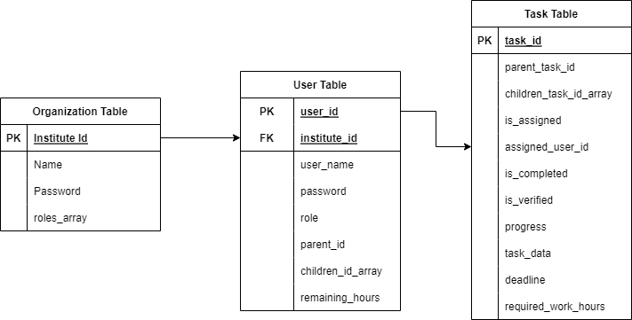
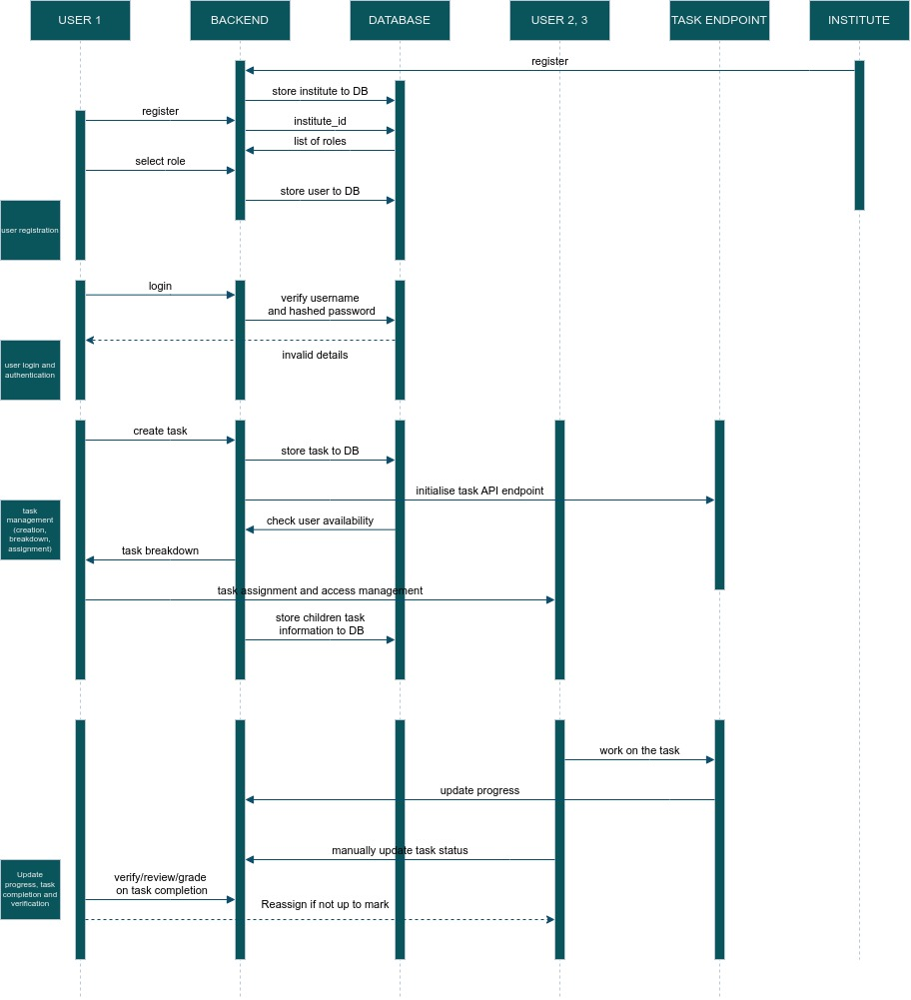
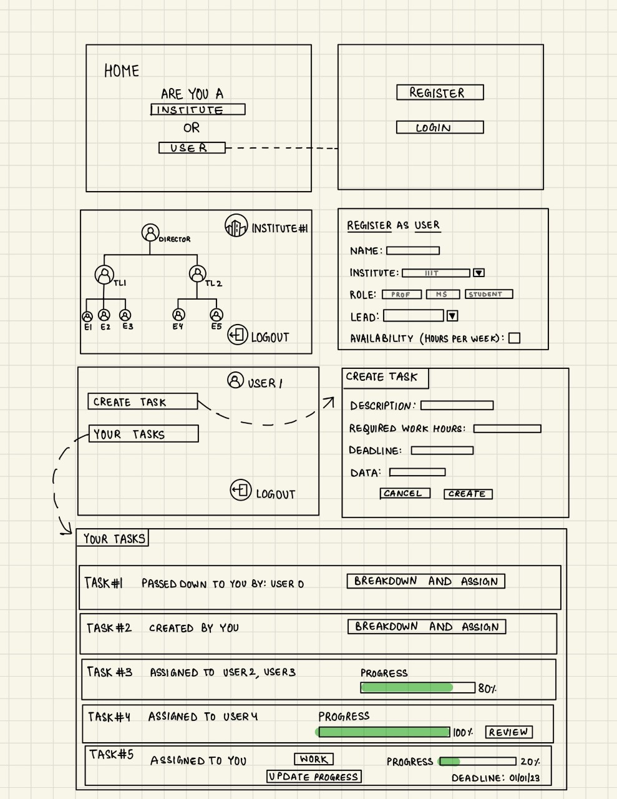

# Student Project Review and Grading System

## Overview - Final Submission

The project is a task management system designed to streamline task assignment, progress tracking, and user management. The system allows users to create and modify user accounts, as well as assign and manage tasks, including creating, modifying, and deleting tasks. Additionally, users can break tasks down into sub-tasks and assign them to lower-hierarchy users. The system features a task assignment feature that allows users to check the availability of other users and assign tasks to specific users based on their roles.

The system provides tools for progress tracking, allowing users to update task progress using an annotation tool API or manually. Higher hierarchy users can track the progress of tasks assigned to lower hierarchy users, and the system displays the progress status of each task and sub-task. Additionally, the system enables higher hierarchy users to review and grade completed tasks and give feedback and suggestions on tasks assigned to lower hierarchy users. Overall, the task management system is designed to improve the efficiency of task assignment, progress tracking, and user management, making it a valuable tool for any organization seeking to improve its task management processes.

## Recommended Technologies

****React + Node.js + Express + MySQL example Overview****

The back-end server will use Node.js + Express for REST APIs. The front-end side will be a React.js client with React Router, Axios & Bootstrap. We will use MySQl for our database.

## Use cases

1. Data Annotation
2. Corporate Setup
3. Research Setup

## Technical ****Requirements****

1. User Management:
1.1. The system shall provide a user registration process to create user accounts.
1.2. The system shall provide an interface to modify user accounts by users with administrative privileges.
1.3. The system shall allow authorized users to delete user accounts.
2. Task Management:
2.1. The system shall provide an interface to manage tasks, including creating, modifying, and deleting tasks.
2.2. The system shall allow the creation of new tasks with relevant information such as due date, priority, and task owner.
2.3. The system shall enable authorized users to modify and delete tasks.
3. Task Breakdown:
3.1. The system shall allow users to break tasks into sub-tasks and assign them to lower-hierarchy users.
4. Task Assignment
4.1. The system shall provide a feature to check the availability of users and prevent conflicting task assignments.
4.2. The system shall enable authorized users to assign tasks to specific users based on their roles.
5. Progress Tracking:
5.1. The system shall allow users to update task progress using an annotation tool API (black-box - API) or manually.
5.2. The system shall enable higher hierarchy users to track the progress of tasks assigned to lower hierarchy users.
5.3. The system shall display the progress status of each task and sub-task.
6. Commenting and Review:
6.1. The system shall enable higher hierarchy users to review and grade completed tasks.
6.2. The system shall allow reviewers to give feedback and suggestions on tasks assigned to lower-hierarchy users.

### Non functional requirements

1. Security: The system should ensure that sensitive information is kept secure and only accessible by authorized users.
2. Performance: The system should be able to handle a large number of concurrent users without degrading performance.
3. Usability: The system should be easy to use, with a clear and intuitive user interface.
4. Scalability: The system should be scalable to accommodate future growth in the number of users and tasks.
5. Reliability: The system should be reliable, with a high uptime and minimal downtime.

## System design - SQL schema

### Organization

- institute_id (String): Unique ID assigned to every organization
- institute_name (String): Name of the organization
- password (String): Password for authentication
- roles_array ([String]): An array storing the the list of all the roles present in the organization

### User

- user_id (String): Unique ID assigned to every user
- user_name (String): User name
- password (String): Password for authentication
- institute_id (String): ID of the organization to which the user belongs
- role (String): Role of the user in the organization
- parent_id (String): ID of the user under whom the user is working
- child_id_array (String): An array of IDs of user who are directly working under this user
- remaining_hours (Integer): The number of hours for which the user is doing no work for this week

### Task

- task_id (String):  Unique ID assigned to every task
- parent_task_id (String): ID of task whose split created this task
- children_task_ids_array ([String]): Array of IDs of task which were created by splitting this task
- creator_user_id (String): ID of user who has created the task
- is_assigned (Boolean): A bool telling whether this task has been assigned or not
- assigned_user_id (String): ID of the user to which this task has been assigned
- working_user_id (String): ID of the user who is working on the task
- progress (Number): The percentage of task that has been completed
- is_completed (Boolean): A bool telling whether the task has been completed or not
- is_verified (Boolean): A bool telling whether the task has been verified after its completion of not
- deadline (Date): The deadline for the task
- task_data (TBD): A placeholder value currently. (We do not know what kind of data we are expected to store)
- required_work_hours(Number): The amount of work hours that will be required to complete this task
- description

## UML diagrams

## Workflow

User creates a task

Task is assigned to him

User goes to assigned tasks

User can breakdown tasks assigned to him

User then assigns these broken down tasks to users of lower heirarchy

If user chooses to assign a broken down task to himself, that brokendown task will be transferred to work_tasks

User has to actually work on work_tasks and cannot assign it to anyone else

### Example

*Director* creates a task to annotate 1000 images from ***Create task*** page

*Director* goes to ***************************Your tasks*************************** page and decide to break it down

*Director* is redirected to ***************************Breakdown*************************** page and gives one share to *********Team Leader 1********* and one share to *************Team Leader 2*************

**************Team Leader 1************** sees that he has been assigned a task to annotate 500 images in his ******************************Your tasks****************************** page.

**************Team Leader 1************** decides to break it down

**************Team Leader 1************** is redirected to the breakdown page and gives one share to ***********Employee 1***********, three shares to ******************Employee 2****************** and one share to **********Employee 3**********

**************Employee 2************** sees that he has been assigned a task to annotate 300 images in his ******************************Your tasks****************************** page.

**************Employee 2************** decides to break it down*.*

**************Employee 2************** is redirected to the breakdown page and sees that ***********Intern 1*********** cannot be assigned new tasks as he is already busy. ***********Employee 2*********** assigns 200 images to *********Intern 2********* and 100 images to himself.

***********Employee 2*********** can now see a tasks where he has to work.

If ***********Employee 1*********** and ********Employee 2******** finish with their work, ******Team Leader 1****** will see in *********************************Your tasks********************************* page that the task is 40% complete while *********Director********* will see that the task is 20% complete.

Once *********Intern 2********* completes annotating 200 images ***********Employee 2*********** has to verify ************Intern 2************’s annotation.

### ****Basic Design of the Webapp****

